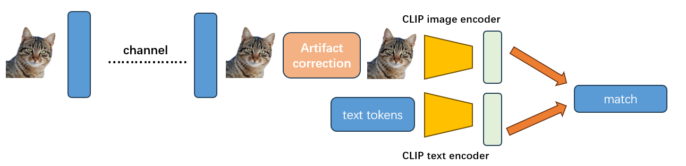
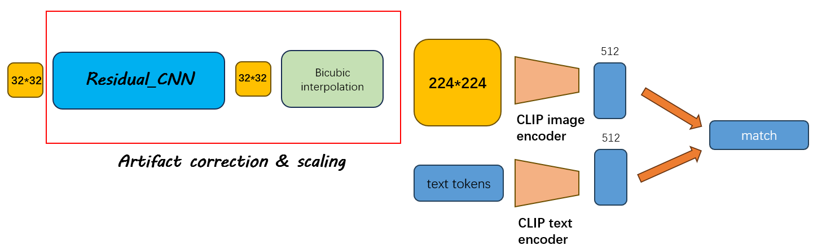
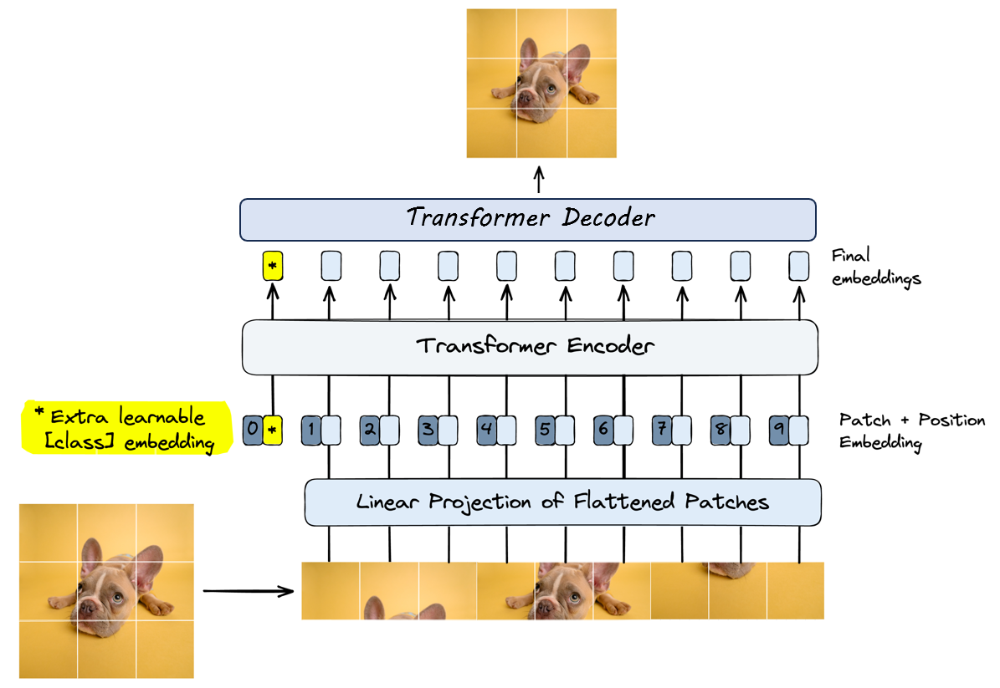
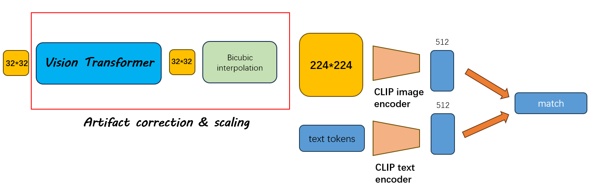

# CLIP Compress

## Literature Review
The paper **"Understanding the Vulnerability of CLIP to Image Compression"** highlights the sensitivity of CLIP regarding jpeg compression of images when performing zero-shot recognition task.

Specifically, for imageset like CIFAR10, the higher the compression ratio is, the poorer performance CLIP would have. The author used JPEG compression quality of 25%, 50% and 75% respectively in the paper.

  
  

Average precision of CLIP predictions over the test dataset from cifar10/stl10 across different image qualities.

## Main problems and objectives
The performance drop due to JPEG compression is much more significant on the CIFAR10 dataset compared to STL10, where the decrease is not particularly notable. 

The authors did not analyze this difference in the paper, but we believe it could be attributed to the impact of **image size**. Since a 32x32 image inherently carries **limited information**, compression leads to a greater loss of detail. Additionally, the compression artifacts introduced by JPEG, such as **blocking effects**, are exacerbated, resulting in poorer performance.

Therefore, we focus on **improving JPEG Artifact Correction** for images with **small resolution** in our work.

## Methodologies (Still improving)
### Section1: Operations on image features
One way to achieve compression while preventing the jpeg issue is to compress the image features instead of images themselves.

#### Method 1.1: Feature quantization
We assume the features to be clean here (i.e., no extra gaussian noise was added), and would like to see whether quantization could save space while achieve comparable performance.

We choose Post-train Quantization (PTQ) as the quantization method, the design of quantization process is as follows:

We used CIFAR10 test set for direct inference on CLIP model.

We also add a meta-net followed the encoded image features for classification task.

| All digits     | Integer digits  |    Accuracy (CLIP's zero-shot prediction)    |  Classification Accuracy (meta-net for classifier)  |  
|----------------|-----------------|----------------------------------------------|-----------------------------------------------------|
| 12             | 8               |    92%                                       |    95.08%                                           |
| 8              | 4               |    88.5%                                     |    94.48%                                           |

#### Method 1.2: Denoise of image features
The method is based on the assumption that it's the **image features** who are transmitted, instead of **compressed images** themselves.

We introduce random Gaussian noise to simulate channel interference.

The goal is to reconstruct the noisy image features back to their clean state at the receiver.

Additionally, we have employed a feature size of 128 for the classification task by integrating a meta-network.

|    Accuracy (CLIP's zero-shot prediction)    |  Classification Validation Accuracy (meta-net on 128-dimension feature)  |  
|----------------|-----------------|
| 73%            |    100%  |

### Section2: Operations on image itself 
The core ideas behind operations on image itself is to correct jpeg artifacts at the receiver before going into CLIP's image encoder.

In practice, the input consists of JPEG-compressed images, representing images received by the receiver, while the supervision labels are the clean, uncompressed images from CIFAR10.

If training is conducted, both training and testing are performed on the CIFAR10 train set and test set. 

If no training is involved, inference is directly carried out on the CIFAR10 test set using the pretrained CLIP model.

#### Method 2.1: SRGAN_based super resolution
Paper referred: *Photo-Realistic Single Image Super-Resolution Using a Generative Adversarial Network*.

Note that besides artifact correction, we also need to scale the image to 224*224 as is required by CLIP's image encoder. We tried to combine these two processes as the SR(super-resolution) process.

SRGAN provides various magnification scales, including <code>*2, *4, and *8</code>. Given the characteristic of CIFAR10 images being 32x32, we opt for <code>*4 and *8</code> magnification scales. 

Our approach is as follows:

**SRGAN and further interpolation** serve as the artifact correction process before the image going into CLIP encoder.

We first attempted to perform direct inference on the CIFAR10 dataset using the pretrained SRGAN (Generator & Discriminator).

We choose jpeg compression rate of **50%** as example to show the resulting effect:
| CLIP pretrained model  | SRGAN scale  |  interpolation method | Accuracy (CLIP's zero-shot prediction)  |  
|----------------|-----------------|-------------------|--------------------------|
| ViT-B/32       | 4               |    bicubic  | 55.474%                                   |
| ViT-B/32       | 8               |    bicubic  | 55.474%                                   |
| ViT-B/32       | 4               |    bilinear | 56.224%                                   |
| ViT-B/32       | 8               |    bilinear | 56.224%                                   |
|    \           |   \             |  \ |  65.09%   (directly zero-shot inference)           |
| RN50           | 4               |    bicubic  | 45.968%                                   |  
| RN50           | 8               |   bicubic  | 45.968%                                    |
| RN50           | 4               |    bilinear  | 46.348%                                  |  
| RN50           | 8               |   bilinear  | 46.348%                                   |
|    \           |   \             |  \ |  56.782%    (directly zero-shot inference)         |

The hidden reason for SRGAN's poorer performance might be that:

Dataset like ImageNet has an original size of **224x224**, which makes their low-resolution versions still interpretable (the smallest version at scale=8 is still **28x28**).

However, the original image size of CIFAR10 is **32x32**, which makes its images of the smallest size (scale=8) only **4x4**, such small images could hardly learn anything.

Therefore, it seems much harder for transfer learning on imageset like CIFAR10.

If we have to do super-resolution, we might first need to scale the original image, or otherwise the learning would be impossible.

#### Method 2.2: Residual CNN for denoise
Paper referred: *Beyond a Gaussian Denoiser: Residual Learning of Deep CNN for Image Denoising*.

The paper serves as a poineer work in image denoising, we believe it better suited for JPEG artifact correction tasks compared to SRGAN. 

Its approach uses a residual network to estimate the residuals caused by JPEG compression. The images initially undergo a conversion from RGB to YCbCr, followed by the residual network learning the artifacts produced by JPEG quantization.

We utilize it for artifact correction and scale it to the required CLIP dimensions (224x224) after training. 

Specifically, we conducted transfer learning on the pretrained model. For each JPEG compression quality level (25%, 50%, 75%), we trained a specific model.

| compression quality | SSIM  |  PSNR | 
|-----|--------|---|
| 25% | 0.9339 | 29.9081 |
| 50% | 0.9608 | 32.4002 |
| 75% | 0.9755 | 34.6168 |        

| JPEG compression quality  |   Accuracy (CLIP's zero-shot prediction)   | 
|---------------------------|--------------------------------------------|
|25%                         |    52.484%                               |
|50%                   |        66.091%   |
|75%                   |     73.032%   |

Note: We've also tested other image artifact correction models, such as **DDRM (JPEG Artifact Correction using Denoising Diffusion Restoration Models)**, we're still progressing with it.

### Method 2.3: Vision Transformer (train from scratch)
We've added an ViT decoder at the end of the proposed ViT architecture, this is made to recontruct images from encoded features.

We input the noisy CIFAR10 images with JPEG compression, and train it with the ground truth of clean images. 

We used SSIM loss (1-SSIM) as training loss, and the metric on test set is MSE.

| JPEG compression quality  |   MSE   | 
|---------------------------|--------------------------------------------|
|25%                         |     0.0023                            |
|50%                   |  0.0016   |
|75%                   | 0.0012  |

The visualization of the reconstructed image look good perceptually. 

However, the model currently achieves rather poor performance (learns nothing), which might be attributed to insufficient training epochs or other underlying environment issues.
| JPEG compression quality  |   Accuracy (CLIP's zero-shot prediction)    | 
|---------------------------|--------------------------------------------|
|25%                         |   10%                           |
|50%                   |  10%   |
|75%                   | 10%  |

Note: We've also built a simple encoder-decoder architecture for artifact removal, and it faces the same problem as with vision transformer.

## Next Step
So far, the main issue with **Operations on the image itself** is that, even though images can be restored very well (as reflected in MSE and SSIM, as well as visualization results);

However, the zero-shot inference performance of the CLIP model has not been ideal.

Moving forward, we plan to conduct more extensive work on CLIP model, rather than merely focusing on zero-shot inference.

A simple example would be to consider not only the **reconstruction losses (such as MSE and SSIM)** during the training of the denoising module but also the **contrastive loss of CLIP model**.
This approach would allow the denoising module to put more emphasis on its performance in the CLIP context.

