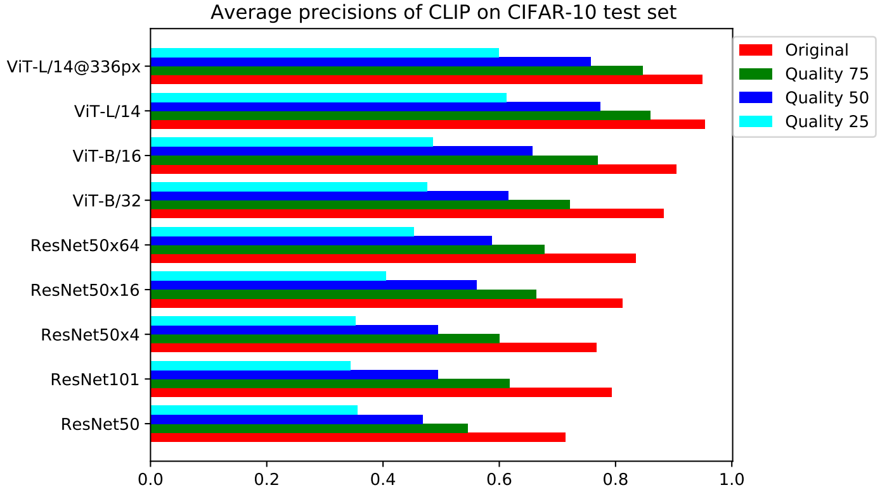
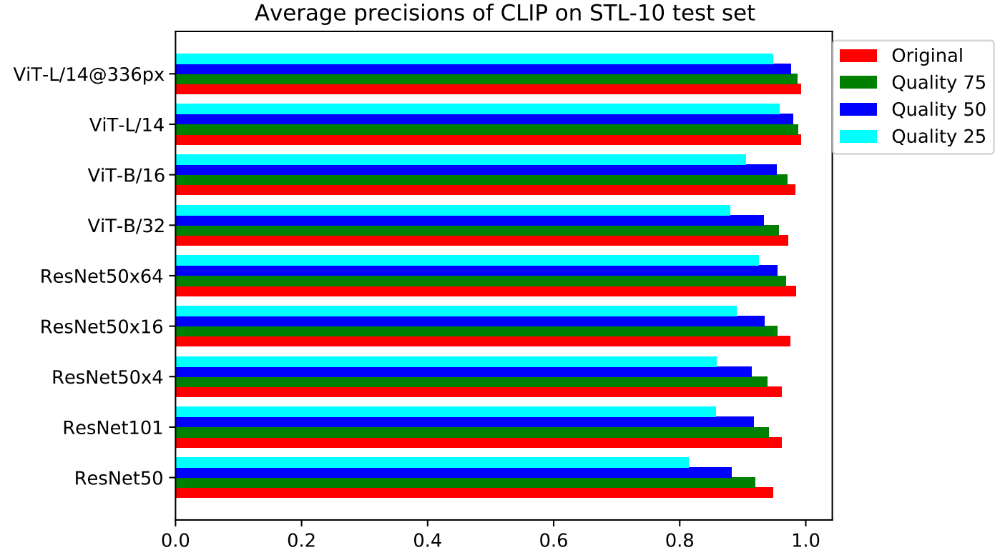
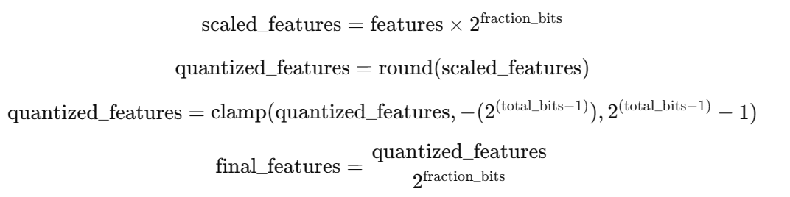
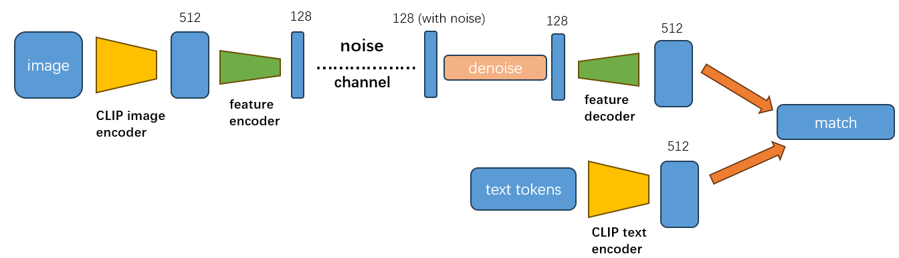
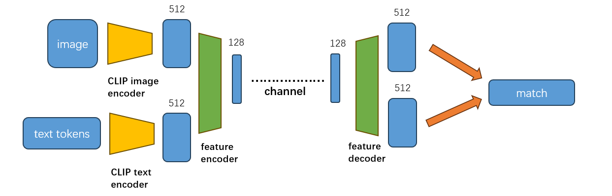
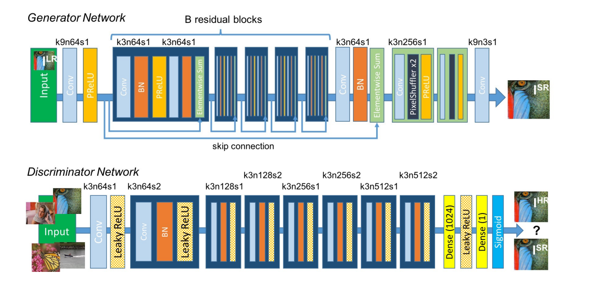
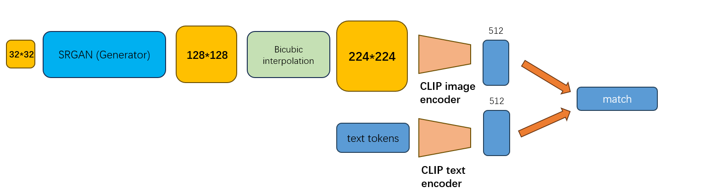
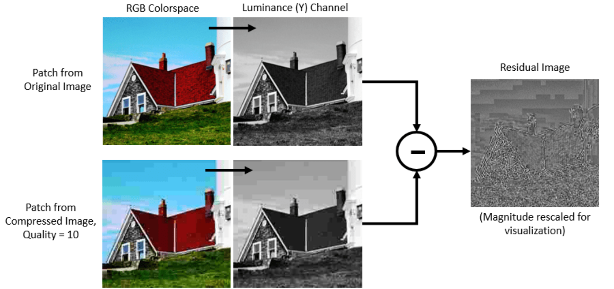

# CLIP Compress

## Literature Review
The paper **"Understanding the Vulnerability of CLIP to Image Compression"** highlights the sensitivity of CLIP regarding jpeg compression of imgs when performing zero-shot recognition task.

  
  

Average precision of CLIP predictions over the test dataset from cifar10/stl10 across different image qualities.

## Main problems and objectives
The performance decline due to JPEG compression is much more significant for the CIFAR10 dataset compared to STL10, where the decrease is not particularly notable. 

The authors did not analyze this aspect in the paper, but we believe it could be attributed to the impact of **image size**. Since a 32x32 image inherently carries **limited information**, compression leads to a greater loss of detail. Additionally, the compression artifacts introduced by JPEG, such as **blocking effects, are exacerbated**, resulting in poorer performance.

Therefore, we focus on **improving JPEG Artifact Correction** in our work.

## Methodologies (Still improving)
### Operations on image features

#### Image feature quantization
We choose Post-train Quantization (PTQ) as quantization method, the design is as follows:

We test our result on CIFAR10 test set (10000 samples)
| All digits     | Integer digits  |    Accuracy (CLIP's zero-shot prediction)    |  Classification Accuracy (meta-net for classifier)  |  
|----------------|-----------------|----------------------------------------------|-----------------------------------------------------|
| 12             | 8               |    92%                                       |    95.08%                                           |
| 8              | 4               |    88.5%                                     |    94.48%                                           |

#### The denoise of image features
The method is based on the assumption that it's the **image features** who are transmitted, instead of **compressed images** themselves.

### Operations on image itself 
#### SRGAN_based super resolution
As besides artifact correction, we also need to scale the image to 224*224 as is required by CLIP's image encoder. We denote this process as the SR(super-resolution process).

SRGAN provides various magnification scales, including <code>*2, *4, and *8</code>. Given the characteristic of CIFAR10 images being 32x32, we opt for *4 and *8 magnification scales. 
Our approach is as follows:

First, we attempt to perform direct inference on the CIFAR10 dataset using the pretrained SRGAN (Generator & Discriminator).
(We take the jpeg compression rate of **50%** as instance)
| CLIP pretrained model  | SRGAN scale  |  interpolation method | Accuracy (CLIP's zero-shot prediction)  |  
|----------------|-----------------|-------------------|--------------------------|
| ViT-B/32       | 4               |    bicubic  | 55.474%                                   |
| ViT-B/32       | 8               |    bicubic  | 55.474%                                   |
| ViT-B/32       | 4               |    bilinear | 56.224%                                   |
| ViT-B/32       | 8               |    bilinear | 56.224%                                   |
|    \           |   \             |  \ |  65.09%   (directly zero-shot inference)           |
| RN50           | 4               |    bicubic  | 45.968%                                   |  
| RN50           | 8               |   bicubic  | 45.968%                                    |
| RN50           | 4               |    bilinear  | 46.348%                                  |  
| RN50           | 8               |   bilinear  | 46.348%                                   |
|    \           |   \             |  \ |  56.782%    (directly zero-shot inference)         |
The hidden reason might be that:
Dataset like ImageNet has original size of 224*224, which makes images of the smallest size (scale=8) 28*28.
However, the original image size of CIFAR10 is 32*32, which makes its images of the smallest size (scale=8) only 4*4, and could hardly learn anything.

Therefore, it seems hard for transfer learning as we might first need to scale original image, or otherwise the learning would be impossible.

#### DCNN_Denoise
DCNN Denoise serves as a poineer work in image denoising, better suited for JPEG artifact correction tasks compared to SRGAN. 

Its approach uses a residual network to estimate the residuals caused by JPEG compression. The images initially undergo a conversion from RGB to YCbCr, followed by the residual network learning the artifacts produced by JPEG quantization.

We conducted transfer learning on the pretrained model. For each jpeg compression quality (25%, 50%, 75%), we trained a specific model.
| compression quality | SSIM  |  PSNR | 
|-----|--------|---|
| 25% | 0.9339 | 29.9081 |
| 50% | 0.9608 | 32.4002 |
| 75% | 0.9755 | 34.6168 |        

We've also tested other image artifact correction models, such as **DDRM (JPEG Artifact Correction using Denoising Diffusion Restoration Models)**, we're still progressing with it.

### Vision Transformer (from scratch)

### CNN-Based Encoder-Decoder

Feature Quantization: Quantizing the number of bits used for each feature. An experiment using 1000 images from the X_test set demonstrated that reducing the precision of features slightly affects test accuracy but can be compensated with a simple meta-net classifier. For instance:
12 bits integer and 8 bits decimal portion resulted in 92% accuracy with CLIP and 95.08% with the classifier.
8 bits integer and 4 bits decimal portion resulted in 88.5% accuracy with CLIP and 94.48% with the classifier.
2. Restoring Compressed Images Before Entering the Image Encoder
2.1 Utilizing Existing General Models for Transfer Learning
The study refers to several models and techniques for improving the quality of compressed images:

JPEG Artifact Correction using Denoising Diffusion Restoration Models: This approach focuses on correcting artifacts introduced by JPEG compression.
Beyond a Gaussian Denoiser: This method involves using a deep convolutional neural network (DCNN) for image denoising, which goes beyond traditional Gaussian noise models.
SRGAN (Super-Resolution Generative Adversarial Network): This method employs a GAN for enhancing the resolution of images to a photo-realistic quality.
2.2 Building Custom Models Based on Current Datasets
For datasets like CIFAR-10, creating custom models that manually reconstruct images has been proposed. This could involve designing networks specifically tuned to the characteristics of the dataset and the type of compression used.

3. Addressing Image Noise and Scaling
Acknowledging that most image transmissions undergo compression which introduces noise, the paper proposes a combined approach of image denoising followed by scaling up to the required size (224*224). This process is treated as a super-resolution task, wherein both denoising and upscaling are handled to restore image quality effectively.

These strategies are designed to enhance the robustness of CLIP against the degradation caused by image compression, ensuring more reliable performance in practical applications where image quality may vary.

